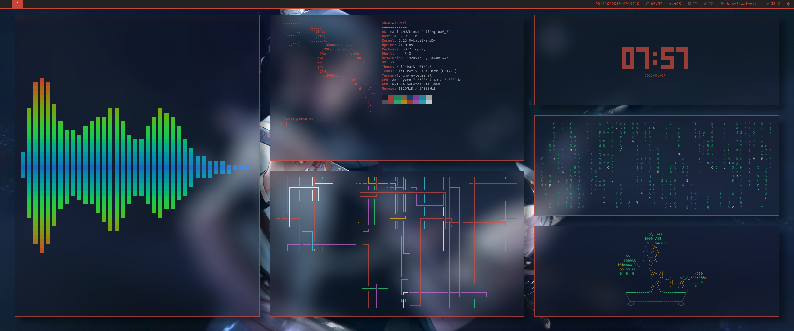

# Skwal dotfiles
- **Picom**
- **I3-gaps**
- **rofi**
- **polybar** 
# Screenshot


# install nerdfonts
download nerd fonts from [here](https://github.com/ryanoasis/nerd-fonts/releases/download/v2.1.0/FiraCode.zip)
```bash
mkdir NerdFonts
unzip FiraCode.zip -d NerdFonts 
mv NerdFonts ~/.local/share/fonts
```
update font cache
```bash
fc-cache -f -v
```

# install packages
### Arch based distros
using an AUR helper
```bash
yay -S rofi picom nitrogen i3-gaps lxappearance polybar mini-matrix
```
### Debian based distros
Add ppa for i3-gaps (if needed)

```bash
sudo add-apt-repository ppa:regolith-linux/release
sudo apt update
```
install required packages
```bash
sudo apt install rofi picom nitrogen i3-gaps lxappearance
```
install dependencies for polybar build 
```bash
sudo apt install build-essential git cmake cmake-data pkg-config python3-sphinx python3-packaging libuv1-dev libcairo2-dev libxcb1-dev libxcb-util0-dev libxcb-randr0-dev libxcb-composite0-dev python3-xcbgen xcb-proto libxcb-image0-dev libxcb-ewmh-dev libxcb-icccm4-dev libjsoncpp-dev libpulse-dev libiw-devast
```
clone polybar 
```bash
git clone --recursive https://github.com/polybar/polybar
```
build polybar
```bash
cd polybar
sudo ./build.sh
```
clone [mini-matrix](https://github.com/SkwalExe/mini-matrix)
```bash
git clone https://github.com/SkwalExe/mini-matrix
```
install mini-matrix
```bash
cd mini-matrix
make
```
# add my dotfiles
### clone this repo 
```bash
git clone https://skwal.net/SkwalExe/dotfiles
cd dotfiles 
cd .config
```
### copy i3 config file
uncomment the line `exec_always --no-startup-id nitrogen --restore` if you use nitrogen 
```bash
# dotfiles/.config/i3
cp config ~/.config/i3/
```
### copy picom config file
```bash
# dotfiles/.config/
cp picom.conf ~/.config/
```
### copy rofi config file
```bash
# dotfiles/.config/rofi
mkdir ~/.config/rofi 
cp config.rasi ~/.config/rofi
```
### copy polybar config file
```bash
# dotfiles/.config/polybar
mkdir ~/.config/polybar
cp * ~/.config/polybar
```
### copy gtk theme
add the padding in gnome-terminal
```bash
# dotfiles/.config/gtk-3.0
cp gtk.css ~/.config/gtk-3.0/
# if you already have a gtk.css
cat gtk.css >> ~/.config/gtk-3.0/gtk.css
```
### Install gnome-terminal profile
```bash
# dotfiles/.config
# create current profiles backup 
dconf dump /org/gnome/terminal/legacy/profiles:/ > ~/gnome-terminal-profiles-backup.dconf;

# load Skwal profile
dconf load /org/gnome/terminal/legacy/profiles:/ < gnome-terminal-profile.dconf; 
```

**Oneliner**
```bash
dconf dump /org/gnome/terminal/legacy/profiles:/ > ~/gnome-terminal-profiles-backup.dconf; echo "Created profiles backup in ~/gnome-terminal-profiles-backup.dconf";dconf load /org/gnome/terminal/legacy/profiles:/ < gnome-terminal-profile.dconf; 
```

**Restore backup**
```bash 
dconf load /org/gnome/terminal/legacy/profiles:/ < ~/gnome-terminal-profiles-backup.dconf
```


# Change gtk theme
### Arch linux
using an AUR helper
```bash
yay -S gnome-themes-extra
```
### Debian based distros
```bash
sudo apt install gnome-themes-extra
```
## Apply the theme using lxappearance
```bash
lxappearance
```
**Widget > Adwaita-Dark**
# set wallpaper
```
nitrogen
```

**don't forget to uncomment the line `exec_always --no-startup-id nitrogen --restore` in the i3 config file**

# Additionnal information
## The polybar config uses [mini-matrix](https://github.com/SkwalExe/mini-matrix)
# Troubleshooting
## Blur not working
**In the picom config `~/.config/picom.conf` change the lines**
```
blur: {
  method = "kawase";
  strength = 10;
  background = false;
  background-frame = false;
  background-fixed = false;
}
```
**to**
```
blur: {
  method = "gaussian";
  size = 20; 
  deviation = 15;
};
```

# final
You can now login to your i3 session, is you have any probleme, don't hesitate to open an issue
# contributing
Pull requests are welcome. For major changes, please open an issue first to discuss what you would like to change.
